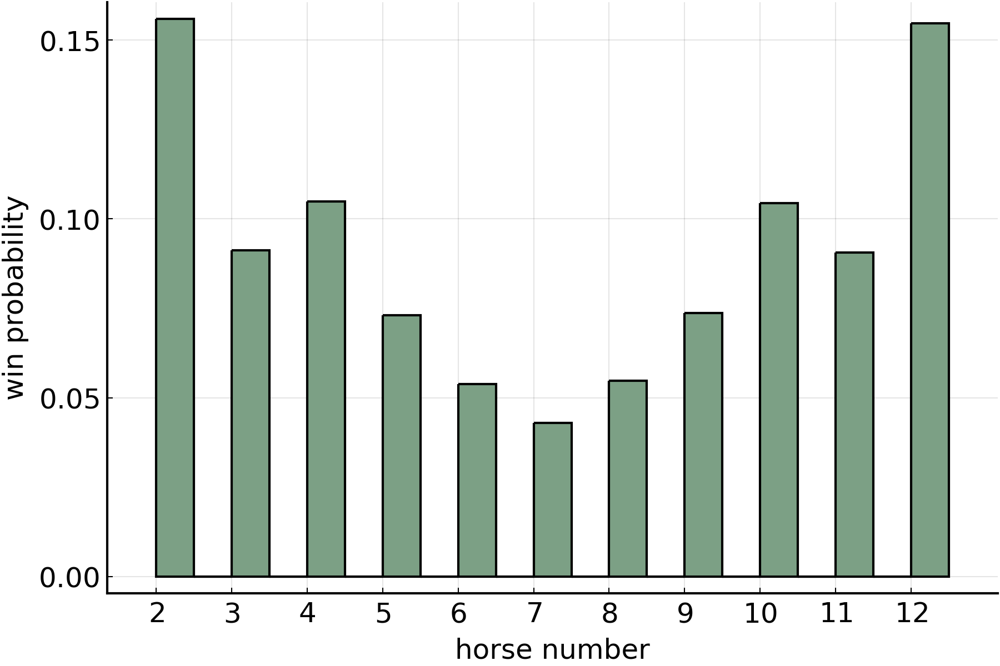

# HorseRace

## Horse Number Distribution

On each turn, the horse number is found by rolling two two six-sided dice and summing the values facing up. As shown below, the probability distribution is symmetrical with 7 being the most likely outcome. 

## Win Probability

On each turn, the horse corresponding to the dice roll moves one step towards the finish line. As shown in the table below, the number of steps required to win is approximately an inverse function of the roll probability. However, the number of steps is not proportional, which can be seen by comparing the numerators in the second column to the required steps in the third column. 

| horse | roll probability | required steps |
|-------|------------------|----------------|
| 2     | 1/32             | 3              |
| 3     | 2/32             | 6              |
| 4     | 3/32             | 8              |
| 5     | 4/32             | 11             |
| 6     | 5/32             | 14             |
| 7     | 6/32             | 17             |
| 8     | 5/32             | 14             |
| 9     | 4/32             | 11             |
| 10    | 3/32             | 8              |
| 11    | 2/32             | 6              |
| 12    | 1/32             | 3              |

The win probability distribution below shows that the number of required steps over-corrects for the differences in roll probability. The chance of horse 2 or 12 winning is approximately 3 times greater than the chance of horse 7 wining.

## Roll Distribution

The figure below shows that the number of rolls required to win depends on the horse number. Distributions for horses 8-12 are omitted because they mirror the distributions for horses 2-6. The mean number of rolls increases while the standard deviation decreases. 

## Payoff Distribution 

The figure below shows the payoff distribution for one game with six players. There are three distinct modes, perhaps corresponding to the number of non-scratched horses in a hand. 

As the number of games increases, the payoff distribution converges on a Gaussian distribution in accordance with the Law of Large Numbers. The figure below shows that the expected value is zero in all cases, but the variance in the payoff distribution increases sublinearly with the number of games. 

